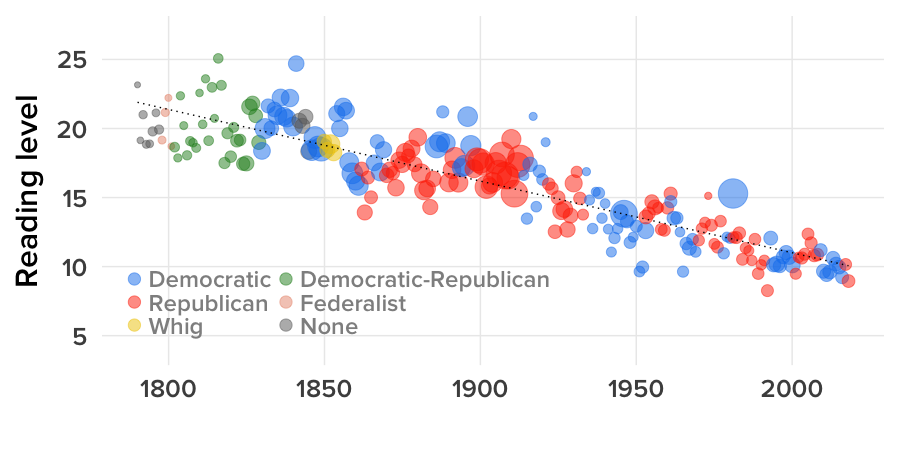
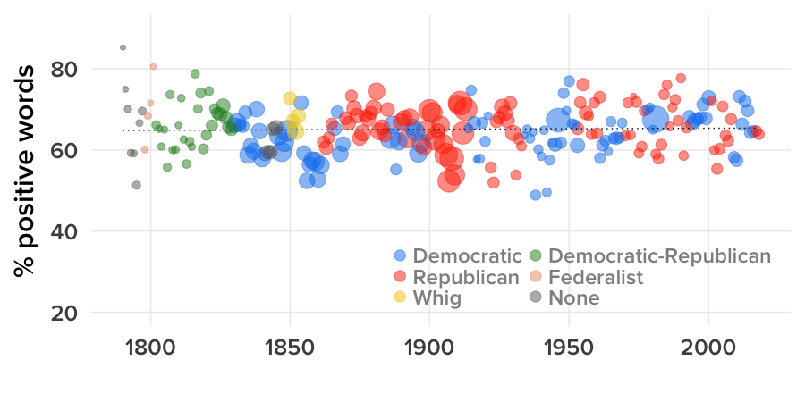
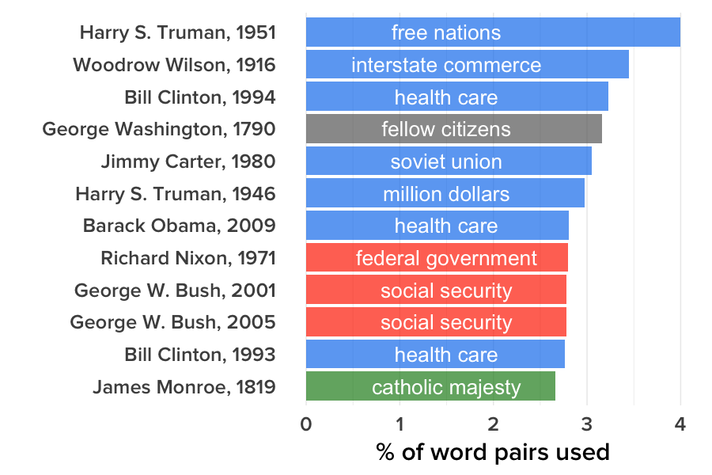

# “I Have The Best Words.” How Trump’s First SOTU Compares To All The Others.

```{r setup, include=FALSE}
library(knitr)
opts_chunk$set(out.width="900px", dpi=300)
```

Data and [R](https://www.r-project.org/) code for the analysis supporting this [Jan. 31, 2018 BuzzFeed News post](https://www.buzzfeed.com/peteraldhous/trump-state-of-the-union-words) analyzing the text of every State of the Union address, including the 2018 speech by President Donald Trump. Supporting files are in [this GitHub repository](https://github.com/BuzzFeedNews/2018-01-trump-state-of-the-union).

### Data

We gathered the text of every State of the Union address from the [American Presidency Project](http://www.presidency.ucsb.edu/sou.php) at the University of California, Santa Barbara. These include speeches to joint sessions of Congress in presidents’ first years of office, which are not officially State of the Union addresses. Some of the addresses were written, some spoken. Where there was both a spoken address and a written message, we used the speech. In 1973, Richard Nixon sent an overview, plus multiple reports to Congress on various areas of policy. Here, we used his overview message.

### Setting up

```{r, results="hide", warning=FALSE, message=FALSE}
# load required packages
library(readr)
library(dplyr)
library(stringr)
library(lubridate)
library(tidyr)
library(tidytext)
library(quanteda)
library(ggplot2)
library(DT)
```

### Load and process data

```{r, results="hide", warning=FALSE, message=FALSE}
# load data
sou <- read_csv("data/sou.csv")
presidents <- read_csv("data/presidents.csv")

sou <- sou %>%
  left_join(presidents)
```

### The Addresses Have Gotten Easier To Understand.

We counted the words, syllables, and sentences in each address, and used these numbers to calculate the [Flesch-Kincaid reading grade level](https://en.wikipedia.org/wiki/Flesch%E2%80%93Kincaid_readability_tests) for each. This presents scores as US school grade levels, and is widely used in education and to assess the readibility of official documents.

```{r, eval=FALSE, warning=FALSE, message=FALSE}
# color palette for parties
party_pal <- c("#1482EE","#228B22","#E9967A","#686868","#FF3300","#EEC900")

# word, sentence, and syllable counts, plus reading scores
sou <- sou %>%
  mutate(year = year(date),
         syllables = nsyllable(text),
         sentences = nsentence(text),
         words = ntoken(text, remove_punct = TRUE),
         fk_ease = 206.835 - 1.105*(words/sentences) - 84.6*(syllables/words),
         fk_grade = 0.39*(words/sentences) + 11.8*(syllables/words) - 15.59) %>%
  arrange(date)

# reading score chart
ggplot(sou, aes(x=date, y=fk_grade, color=party, size=words)) +
  geom_point(alpha=0.5) +
  geom_smooth(se=F, color="black", method="lm", size=0.5, linetype = "dotted") +
  scale_size_area(max_size = 10, guide = FALSE) +
  scale_color_manual(values = party_pal, name = "", breaks = c("Democratic","Republican","Whig","Democratic-Republican","Federalist","None")) +
  scale_y_continuous(limits = c(4,27), breaks = c(5,10,15,20,25)) +
  theme_minimal(base_size = 24, base_family = "ProximaNova-Semibold") +
  xlab("") +
  ylab("Reading level") +
  guides(col = guide_legend(ncol = 2, override.aes = list(size = 4))) +
  theme(legend.position=c(0.3,0.22),
        legend.text = element_text(color="#909090", size = 18),
        panel.grid.minor = element_blank())
```



### The State Of The Union Is … As Positive As It Ever Was.

We ran a sentiment analysis using the [lexicon](https://www.cs.uic.edu/~liub/FBS/sentiment-analysis.html) developed by [Bing Lui](https://www.cs.uic.edu/~liub/) of the University of Illinois at Chicago and colleagues.  Values for positive words in each address are shown as percentages of all positive and negative words.


```{r, eval=FALSE, warning=FALSE, message=FALSE}
# load lexicon from https://www.cs.uic.edu/~liub/FBS/sentiment-analysis.html
bing <- get_sentiments("bing")

# sentiment by address
sentiments <- sou %>%
  unnest_tokens(word, text) %>%
  filter(str_detect(word, "[a-z]")) %>%
  # match to lexicon
  inner_join(bing, by = "word")

sentiments_counts <- sentiments %>%
  group_by(president,party,date,words) %>%
  count(sentiment) %>%
  arrange(-n)

positive_freqs <- sentiments_counts %>%
  left_join(sentiments_counts %>% 
              group_by(president,party,date,words) %>% 
              summarise(total = sum(n))) %>%
  mutate(percent = round(n/total*100,2)) %>%
  filter(sentiment == "positive")

# sentiment chart
ggplot(positive_freqs, aes(x=date, y=percent, color=party, size = words)) +
  geom_point(alpha=0.5) +
  geom_smooth(se=F, color="black", method="lm", size=0.5, linetype = "dotted") +
  scale_size_area(max_size = 10, guide = FALSE) +
  scale_color_manual(values = party_pal, name = "", breaks = c("Democratic","Republican","Whig","Democratic-Republican","Federalist","None")) +
  scale_y_continuous(limits = c(20,90)) +
  theme_minimal(base_size = 24, base_family = "ProximaNova-Semibold") +
  xlab("") +
  ylab("% positive words") +
  guides(col = guide_legend(ncol = 2, override.aes = list(size = 4))) +
  theme(legend.position=c(0.7,0.2),
        legend.text = element_text(color="#909090", size = 18),
        panel.grid.minor = element_blank())
```




### This Is What Presidents Have Obsessed About Over History.

We split the text of each address, into word pairs, or bigrams, filtering out any bigrams containing stop words from the [tidytext](https://cran.r-project.org/web/packages/tidytext/vignettes/tidytext.html) R package. Then we calculated the frequency of each bigram as a percentage of all the bigrams used in each address. The chart below shows the most shows the addresses in which the top bigram was used most heavily.

Trump's top bigram in 2018 was "American people," which accounted for just 0.7% of his word pairs, closely followed by "North Korea" and "tax cuts."

```{r, eval=FALSE, warning=FALSE, message=FALSE}
# break text into bigrams
bigrams <- sou %>% 
  unnest_tokens(bigram, text, token = "ngrams", n = 2) %>%
  separate(bigram, into = c("first","second"), sep = " ", remove = FALSE) %>%
  # remove stop words from tidytext package 
  anti_join(stop_words, by = c("first" = "word")) %>%
  anti_join(stop_words, by = c("second" = "word")) %>%
  filter(str_detect(first, "[a-z]"),
         str_detect(second, "[a-z]")) %>%
  group_by(president,party,date,year,words) %>%
  count(bigram) %>%
  arrange(-n)

bigram_freqs <- bigrams %>% 
  left_join(bigrams %>% 
              group_by(president,party,date,year,words) %>% 
              summarise(total = sum(n))) %>%
  mutate(percent = n/total*100) %>%
  group_by(president,party,date)

# get the top bigram for each address
top_bigrams <- bigram_freqs %>%
  top_n(1) %>%
  arrange(-percent)

top_bigram_freqs <- bigram_freqs %>%
  semi_join(top_bigrams) %>%
  ungroup() %>%
  arrange(-percent) %>%
  mutate(year = year(date),
         address = paste0(president,", ",year))

# some cleaning for display in chart
top_bigram_freqs$address <- gsub("William J.","Bill", top_bigram_freqs$address)

# color palette for this chart
bigram_pal <- c("#1482EE","#228B22","#686868","#FF3300","#EEC900")

# chart
ggplot(top_bigram_freqs[1:12,], aes(x=reorder(address,percent), y=percent, fill=party, label=bigram)) +
  geom_bar(stat = "identity", alpha = 0.7) +
  geom_text(aes(y = 1.5), color = "#FFFFFF", size = 7) +
  scale_fill_manual(values = bigram_pal, guide = FALSE) +
  theme_minimal(base_size = 24, base_family = "ProximaNova-Semibold") +
  theme(panel.grid.major.y = element_blank(),
        panel.grid.minor.y = element_blank()) +
  xlab("") +
  ylab("% of word pairs used") +
  coord_flip()
```



### There Have Been New Words With Each Address. Here Are Some Of Trump’s.

```{r, warning=FALSE, message=FALSE}
# make sure data is sorted in date order
sou <- sou %>%
  arrange(date)

# empty data frames 
first_words = data_frame()
old_words <- data_frame()

# loop through each address, comparing to predecessors to select new words
n <- 1
for (l in sou$link) {
  previous <- sou[n-1,]
  previous_words <- previous %>%
    unnest_tokens(word, text) %>%
    filter(str_detect(word, "[a-z]")) %>%
    anti_join(stop_words) %>%
    unique()
  old_words <- bind_rows(old_words, previous_words)
  tmp <- sou %>%
    filter(link == l)
  tmp_words <- tmp %>%
    unnest_tokens(word, text) %>%
    filter(str_detect(word, "[a-z]")) %>%
    anti_join(stop_words) %>%
    unique()
  new_words = base::setdiff(tmp_words$word, old_words$word)
  tmp_df <- data_frame(link = l, word = new_words)
  first_words <- bind_rows(first_words,tmp_df)
  n <- n+1
}

first_words <- inner_join(sou,first_words) %>%
  select(president,party,date,word) %>%
  arrange(desc(date))

datatable(first_words)
```


